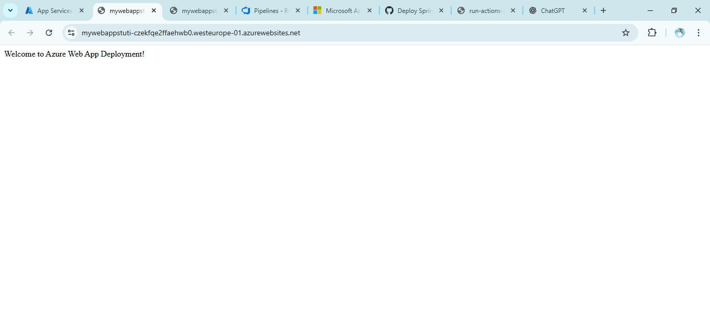
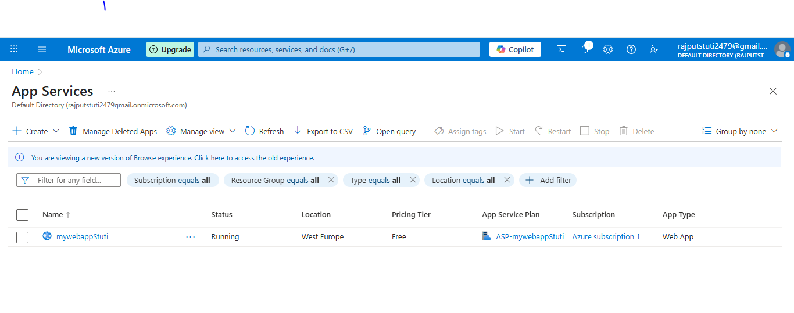
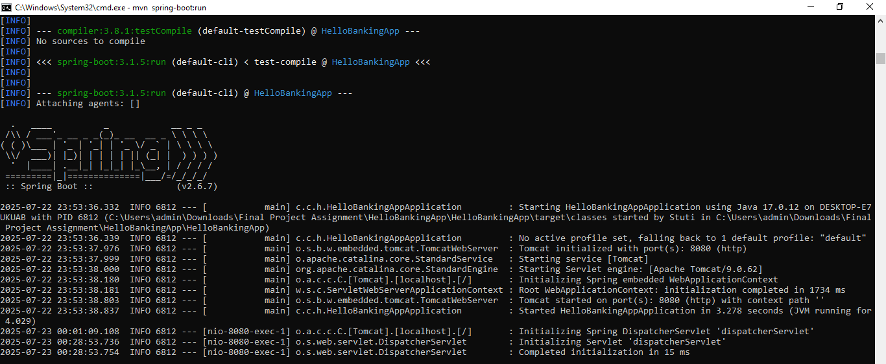

# 🚀 HelloBankingApp

A simple **Spring Boot-based Java web application**, deployed on **Azure App Services** using **GitHub Actions (CI/CD pipeline)**. Built as part of my DevOps Internship Project at **Celebal Technologies**.

---

## 📁 Project Structure

```
HelloBankingApp/
├── .github/workflows/
│   └── deploy-java.yml     # CI/CD Pipeline
├── src/main/java/com/celebal/hellobanking/
│   ├── HelloBankingAppApplication.java
│   └── HomeController.java
├── pom.xml                 # Maven Configuration
├── README.md
└── screenshots/            # Output Images for README
```

---

## 💡 Tech Stack

- ☕ Java 17  
- 🧪 Spring Boot  
- 📦 Maven  
- ☁️ Azure App Services  
- 🔁 GitHub Actions (CI/CD)

---

## ⚙️ CI/CD Pipeline

**Workflow File:** `.github/workflows/deploy-java.yml`

This pipeline:
- 🔨 Builds the app with Maven
- 📦 Uploads the artifact
- 🚀 Deploys to Azure Web App

```yaml
on:
  push:
    branches:
      - main

jobs:
  build-and-deploy:
    runs-on: ubuntu-latest

    steps:
      - name: Checkout Code
        uses: actions/checkout@v3

      - name: Set up Java
        uses: actions/setup-java@v3
        with:
          java-version: '17'

      - name: Build with Maven
        run: mvn clean install

      - name: Deploy to Azure Web App
        uses: azure/webapps-deploy@v2
        with:
          app-name: mywebappStuti
          publish-profile: ${{ secrets.AZUREAPPSERVICE_PUBLISHPROFILE }}
          package: target/HelloBankingApp-1.0.0.jar
```

---

## 🧪 Run Locally

```bash
# Clone the repo
git clone https://github.com/Rajput2456/webapp-cicd-github.git

# Navigate into project
cd HelloBankingApp

# Build the app
mvn clean install

# Run the app
mvn spring-boot:run
```

The app will be available at:  
🔗 `http://localhost:8080`

---

## 🌐 Live Demo

Your app is live at:  
🔗 [http://mywebappstuti-czekfq...azurewebsites.net](http://mywebappstuti-czekfq2ffaehwb0.westeurope-01.azurewebsites.net)

> ⚠️ Use **HTTP**, not HTTPS  
> 🕵️‍♂️ Open in **Incognito Mode** to avoid forced HTTPS redirection

---

## 📸 Output Screenshots

### ✅ Live App Home Page  


### ✅ GitHub Repository  


### ✅ Azure Web App Running  


### ✅ Console Output (Local Run)  


---

## 🧑‍💻 Developed By

**Stuti Rajput**  
🎓 Intern @ Celebal Technologies  
🔗 [LinkedIn](https://linkedin.com/in/yourprofile)  
💻 [GitHub](https://github.com/Rajput2456)

---

## 🔐 GitHub Secrets Required

Make sure this is configured:

- `AZUREAPPSERVICE_PUBLISHPROFILE` → added under  
  👉 **GitHub → Settings → Secrets → Actions**

---

## 📝 Notes

- App name in the workflow YAML **must exactly match** the one in Azure Portal.
- HTTP only: Azure free tier apps may auto-redirect HTTPS.
- Screenshots must be placed inside a folder named `screenshots/`.

---

## 📌 License

This project is built for educational/demo purposes under an internship assignment.
